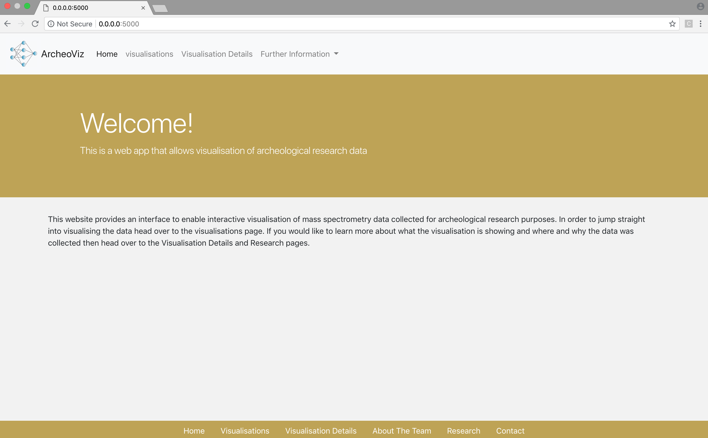
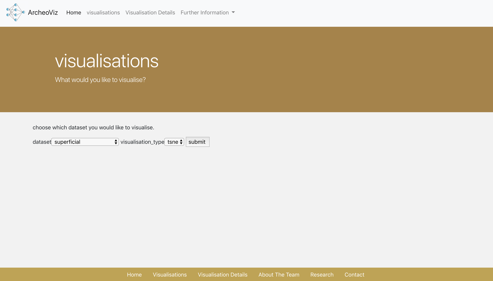
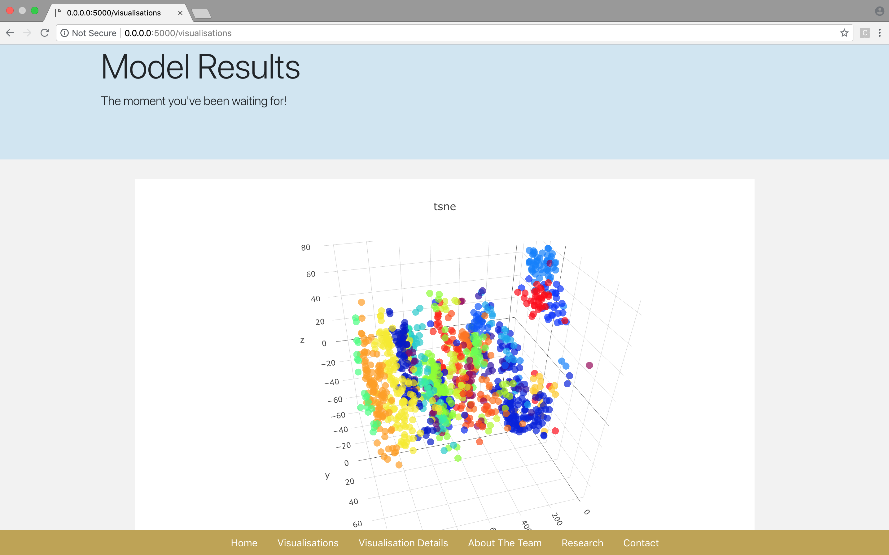

## ArcheoViz


### This is a web application that allows visualisation of t-SNE and PCA projections of flint sample and artefact data. 

To use this web application you must first install Docker.

* The repository needs to be cloned

* Then change directory into the repo:

`cd archeoApp_basic/`

* The docker image needs to be made:

`docker-compose up` 

* Go to the following URL:

http://0.0.0.0:5000

This is the home page:


Go to the 'visualisations' page to input which dataset and which transformation you would like to visualise:


This s an example of the types of visualisation that can be visualised and interacted with, hovering of the right hand corner of the visualisation box gives options for how to interact with the plot.



https://betterprogramming.pub/how-to-containerize-and-deploy-apps-with-docker-and-heroku-b1c49e5bc070

heroku login
heroku container:login
heroku create

then follow this

https://stackoverflow.com/questions/50788725/deploy-docker-image-not-dockerfile-to-heroku

```bash
docker tag  <image_name> registry.heroku.com/<heroku app name>/image_name
```
```bash
docker push registry.heroku.com/<heroku app name>/image_name
```
```bash
heroku container:release <image_name> --app=<heroku app name>
```

then back to this 

https://betterprogramming.pub/how-to-containerize-and-deploy-apps-with-docker-and-heroku-b1c49e5bc070

```bash

heroku open
```

Now add the add-ons in heroku


docker build .


docker run -p 5000:5000 -d <image id>
